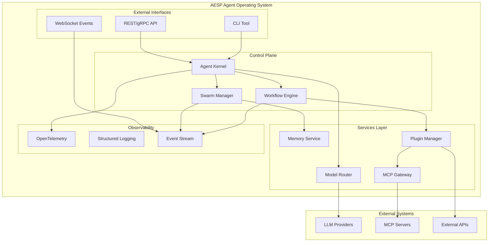

# AESP Reference Implementation — Agent Operating System

[](https://github.com/kishoreHQ/AESP-Reference-Implementation/actions/workflows/ci.yml)
[](https://opensource.org/licenses/MIT)
[](https://github.com/kishoreHQ/AESP)
[](https://discord.gg/aesp)

> **Production reference implementation of the Autonomous Engineering Specification (AESP).**  
> An open-source Agent Operating System for autonomous AI engineering organizations.

---

## What is AESP?

The **Autonomous Engineering Specification (AESP)** defines the architecture, protocols, and interfaces for building autonomous AI engineering systems — organizations of AI agents that collaborate to design, build, test, deploy, and operate software systems with minimal human intervention.

This repository contains the **official production reference implementation** — a complete, vendor-neutral Agent Operating System that demonstrates how to build and run AESP-compliant systems.

- **Specification**: [kishoreHQ/AESP](https://github.com/kishoreHQ/AESP)
- **Examples & Recipes**: [kishoreHQ/AESP-Examples](https://github.com/kishoreHQ/AESP-Examples)
- **Documentation**: [Full Documentation](https://aesp.dev/docs)

---

## Architecture Overview



---

## Core Components

| Component | Description | Status |
|-----------|-------------|--------|
| **Agent Kernel** | Core runtime for individual agent lifecycle and execution | Planned |
| **Swarm Manager** | Orchestrates multi-agent collaboration and communication | Planned |
| **Memory Service** | Persistent storage for agent state, context, and knowledge | Planned |
| **Workflow Engine** | DAG-based task orchestration with dependency management | Planned |
| **Plugin Manager** | Dynamic loading and management of capability plugins | Planned |
| **MCP Gateway** | Model Context Protocol server/client integration | Planned |
| **Model Router** | Intelligent routing across LLM providers with fallback | Planned |
| **Observability Stack** | OpenTelemetry-based tracing, metrics, and structured logging | Planned |

---

## Quick Start

### Prerequisites

- **Language Runtime**: Go 1.23+ (primary), Python 3.12+ (SDK), Node.js 20+ (SDK)
- **Infrastructure**: Docker, Docker Compose or Kubernetes
- **LLM Access**: API keys for at least one LLM provider (OpenAI, Anthropic, or local via Ollama)

### Installation

```bash
# Clone the repository
git clone https://github.com/kishoreHQ/AESP-Reference-Implementation.git
cd AESP-Reference-Implementation

# Build all components
make build

# Run tests
make test

# Start the local development stack
make dev-up
```

### Your First Agent Swarm

```bash
# Start the control plane
make dev-up

# In another terminal, deploy a sample workflow
./bin/aesp-cli swarm deploy --file examples/hello-world.yaml

# Watch the swarm execute
./bin/aesp-cli swarm logs --follow --swarm hello-world
```

### Programmatic Usage

```go
package main

import (
    "context"
    "fmt"
    "log"

    "github.com/kishoreHQ/aesp/pkg/agent"
    "github.com/kishoreHQ/aesp/pkg/kernel"
)

func main() {
    ctx := context.Background()

    // Initialize the agent kernel
    k, err := kernel.New(kernel.Config{
        ModelProvider: "openai",
        ModelName:     "gpt-4o",
    })
    if err != nil {
        log.Fatal(err)
    }

    // Create an agent
    a, err := k.CreateAgent(ctx, agent.Config{
        Name:        "code-reviewer",
        Description: "Reviews code changes for quality and correctness",
        Capabilities: []string{"code-analysis", "review", "suggestions"},
    })
    if err != nil {
        log.Fatal(err)
    }

    // Execute a task
    result, err := a.Execute(ctx, agent.Task{
        Type: "code-review",
        Input: map[string]interface{}{
            "files": []string{"src/main.go", "src/utils.go"},
        },
    })
    if err != nil {
        log.Fatal(err)
    }

    fmt.Printf("Result: %+v\n", result)
}
```

---

## Project Structure

```
AESP-Reference-Implementation/
├── cmd/                    # Command-line applications
│   ├── aespd/             # Main daemon / control plane
│   ├── aesp-cli/          # CLI tool for interacting with the system
│   └── aesp-agent/        # Standalone agent runner
├── pkg/                    # Public library code
│   ├── agent/             # Agent runtime and lifecycle
│   ├── kernel/            # Agent Kernel core
│   ├── swarm/             # Swarm orchestration
│   ├── memory/            # Memory and state management
│   ├── workflow/          # Workflow engine
│   ├── plugin/            # Plugin system
│   ├── mcp/               # MCP gateway
│   ├── router/            # Model router
│   ├── observability/     # Telemetry and logging
│   ├── api/               # API types and clients
│   └── crypto/            # Cryptographic utilities
├── internal/               # Private implementation details
│   ├── server/            # HTTP/gRPC server implementations
│   ├── persistence/       # Database implementations
│   ├── scheduler/         # Task scheduling
│   └── auth/              # Authentication and authorization
├── api/                    # API definitions
│   ├── proto/             # Protocol Buffer schemas
│   ├── openapi/           # OpenAPI/Swagger specifications
│   └── graphql/           # GraphQL schemas (future)
├── web/                    # Web dashboard (React/Vue)
├── sdk/                    # Language SDKs
│   ├── go/                # Go SDK
│   ├── python/            # Python SDK
│   └── typescript/        # TypeScript SDK
├── deployments/            # Deployment configurations
│   ├── docker/            # Docker Compose stacks
│   ├── kubernetes/        # K8s manifests and Helm charts
│   └── terraform/         # Infrastructure as Code
├── config/                 # Configuration schemas and defaults
├── test/                   # Integration and E2E tests
├── docs/                   # Documentation
│   ├── architecture.md    # Architecture documentation
│   ├── adr/               # Architecture Decision Records
│   └── guides/            # User and developer guides
├── scripts/                # Build and utility scripts
├── Makefile               # Build automation
└── README.md              # This file
```

---

## Development Setup

### Requirements

| Tool | Version | Purpose |
|------|---------|---------|
| Go | 1.23+ | Primary implementation language |
| Python | 3.12+ | Python SDK and tooling |
| Node.js | 20+ | TypeScript SDK and web dashboard |
| Docker | 24+ | Container runtime |
| Docker Compose | 2.20+ | Local development stack |
| Make | 4.3+ | Build automation |
| protoc | 25+ | Protocol buffer compilation |

### Local Development

```bash
# 1. Install dependencies
make deps

# 2. Generate code (protobuf, mocks, etc.)
make generate

# 3. Build all components
make build

# 4. Run unit tests
make test

# 5. Run integration tests (requires Docker)
make test-integration

# 6. Start the full development stack
make dev-up

# 7. Run linting
make lint

# 8. Format code
make fmt
```

### IDE Configuration

Recommended IDE setup for contributors:

- **VS Code**: Install the Go, Python, and ESLint extensions. Configuration in `.vscode/settings.json`.
- **GoLand**: Project is pre-configured with run configurations in `.run/`.
- **Neovim**: Configuration for `nvim-lspconfig` and `null-ls` is in `docs/editors/nvim.md`.

---

## Testing Guide

### Test Pyramid

```
    /\\
   /  \\      E2E Tests (test/e2e/)
  /----\\
 /      \\    Integration Tests (test/integration/)
/--------\\
           \\  Unit Tests (per-package *_test.go)
```

### Running Tests

```bash
# Unit tests only
make test

# Integration tests (requires Docker)
make test-integration

# End-to-end tests
make test-e2e

# Specific package
make test PKG=./pkg/agent

# With coverage report
make test-coverage

# With race detection
make test-race
```

### Test Philosophy

- **Unit tests**: Fast, isolated, no external dependencies. Run on every commit.
- **Integration tests**: Test component interactions with real dependencies (Dockerized). Run on PR.
- **E2E tests**: Full system tests with real LLM calls (controlled). Run on release.
- **Property tests**: Critical paths use property-based testing (via `testing/quick` or `gopter`).
- **Contract tests**: API contracts tested via Pact or similar.

---

## Contributing

We welcome contributions! Please read our [Contributing Guide](CONTRIBUTING.md) for details on:

- Code of Conduct
- Development workflow
- Commit message conventions
- Pull request process
- Release process

### Quick Contributions

```bash
# Fork and clone
git clone https://github.com/YOUR_USERNAME/AESP-Reference-Implementation.git

# Create a feature branch
git checkout -b feat/your-feature-name

# Make changes, test, commit
make test
git commit -m "feat: add your feature"

# Push and create PR
git push origin feat/your-feature-name
```

---

## Technology Stack

| Layer | Technology | Rationale |
|-------|-----------|-----------|
| **Core Runtime** | Go 1.23+ | Performance, concurrency, deployment simplicity |
| **SDKs** | Go, Python, TypeScript | Broad ecosystem coverage |
| **Communication** | gRPC + Protocol Buffers | High-performance, typed interfaces |
| **API Gateway** | HTTP/2 + gRPC-Web | Browser and service accessibility |
| **Persistence** | PostgreSQL + Redis | Relational data + caching/sessions |
| **Message Queue** | NATS / Redis Streams | Lightweight, high-throughput messaging |
| **Observability** | OpenTelemetry + Prometheus + Grafana | Vendor-neutral observability |
| **Deployment** | Docker + Kubernetes | Cloud-native, portable deployment |

---

## Roadmap

| Phase | Target | Deliverables |
|-------|--------|--------------|
| **Phase 0** | Q1 2025 | Project bootstrap, CI/CD, architecture docs |
| **Phase 1** | Q2 2025 | Agent Kernel, basic Swarm, Memory Service |
| **Phase 2** | Q3 2025 | Workflow Engine, Plugin Manager, MCP Gateway |
| **Phase 3** | Q4 2025 | Model Router, Observability, Web Dashboard |
| **Phase 4** | Q1 2026 | Performance optimization, enterprise features |

---

## Community

- **Discord**: [Join the community](https://discord.gg/aesp)
- **Discussions**: [GitHub Discussions](https://github.com/kishoreHQ/AESP-Reference-Implementation/discussions)
- **Issues**: [GitHub Issues](https://github.com/kishoreHQ/AESP-Reference-Implementation/issues)
- **Mailing List**: [aesp-dev@googlegroups.com](mailto:aesp-dev@googlegroups.com)

---

## Security

Security is a critical priority for the AESP project. If you discover a security vulnerability, please follow our [Security Policy](SECURITY.md):

- **DO NOT** open a public issue
- Email security reports to: security@aesp.dev
- We follow responsible disclosure practices

---

## License

This project is licensed under the MIT License — see the [LICENSE](LICENSE) file for details.

Copyright (c) 2025 Kishore Kumar Behera and the AESP Contributors.

---

## Acknowledgments

- The AESP specification is developed by the [AESP Standards Committee](https://github.com/kishoreHQ/AESP)
- Inspired by the Model Context Protocol (MCP) from Anthropic
- Built with lessons from Kubernetes, Temporal, and modern distributed systems

---

<div align="center">

**[Getting Started](https://aesp.dev/docs/getting-started)** • **[Documentation](https://aesp.dev/docs)** • **[API Reference](https://aesp.dev/api)** • **[Contribute](CONTRIBUTING.md)**

</div>
