# AESP Reference Implementation — Architecture

> **Version**: 0.1.0-alpha  
> **Status**: Draft  
> **Last Updated**: 2025-01-15

---

## Table of Contents

- [System Overview](#system-overview)
- [Design Principles](#design-principles)
- [Component Architecture](#component-architecture)
- [Core Modules](#core-modules)
  - [Agent Kernel](#1-agent-kernel)
  - [Swarm Manager](#2-swarm-manager)
  - [Memory Service](#3-memory-service)
  - [Workflow Engine](#4-workflow-engine)
  - [Plugin Manager](#5-plugin-manager)
  - [MCP Gateway](#6-mcp-gateway)
  - [Model Router](#7-model-router)
  - [Observability Stack](#8-observability-stack)
- [Data Flow](#data-flow)
- [Technology Stack](#technology-stack)
- [Deployment Architecture](#deployment-architecture)
- [Security Model](#security-model)
- [Extensibility](#extensibility)

---

## System Overview

The AESP Reference Implementation is a distributed Agent Operating System that enables the creation, orchestration, and management of autonomous AI engineering organizations. It implements the [Autonomous Engineering Specification](https://github.com/kishoreHQ/AESP) as a production-ready, vendor-neutral platform.

### What is an Agent Operating System?

An Agent Operating System provides the foundational infrastructure for AI agents to:

- **Execute** tasks with guaranteed delivery and fault tolerance
- **Communicate** through standardized protocols with other agents and services
- **Remember** context, state, and learnings across sessions
- **Collaborate** in swarms to accomplish complex engineering goals
- **Observe** their own behavior and system health
- **Extend** capabilities through a plugin architecture

### High-Level Architecture

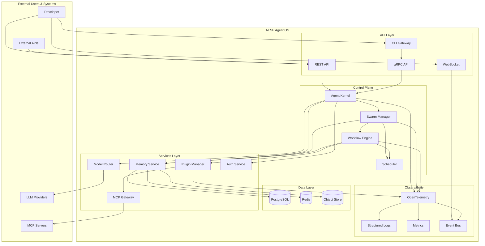

---

## Design Principles

The architecture is guided by the following principles:

### 1. Vendor Neutrality

No dependency on a single LLM provider, cloud platform, or infrastructure vendor. All integrations are abstracted behind interfaces.

### 2. Modularity

Each component is independently deployable, testable, and replaceable. Components communicate through well-defined APIs.

### 3. Protocol-First

All interfaces are defined using Protocol Buffers and OpenAPI specifications. Implementation follows the protocol, not the other way around.

### 4. Event-Driven

The system uses an event-driven architecture for loose coupling. All significant state changes emit events that can be consumed by other components.

### 5. Observable by Design

Every component emits OpenTelemetry traces, metrics, and logs by default. Observability is not an afterthought.

### 6. Security by Default

All communications are authenticated and authorized. Secrets are never logged. The principle of least privilege is applied throughout.

### 7. Cloud-Native

Built for containerized deployment on Kubernetes. Supports horizontal scaling, health checks, and graceful shutdown.

---

## Component Architecture

### Component Diagram

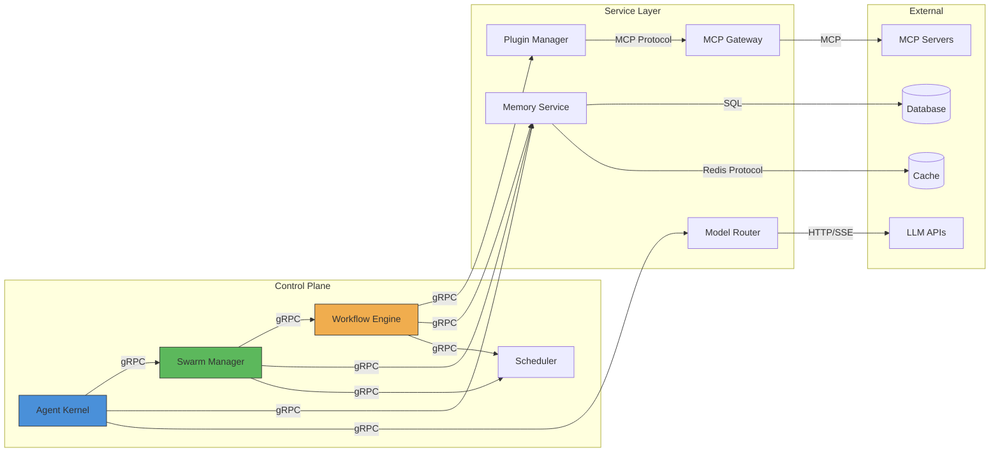

### Component Responsibilities

| Component | Responsibility | Interfaces |
|-----------|---------------|------------|
| Agent Kernel | Agent lifecycle, execution context, capability management | gRPC, internal |
| Swarm Manager | Multi-agent orchestration, communication routing | gRPC, Event Bus |
| Workflow Engine | DAG execution, task dependency management | gRPC, Event Bus |
| Memory Service | State persistence, context retrieval, knowledge storage | gRPC, SQL |
| Plugin Manager | Plugin discovery, loading, sandboxing | gRPC, internal |
| MCP Gateway | MCP client/server protocol handling | MCP Protocol |
| Model Router | Provider abstraction, routing, fallback, caching | gRPC, HTTP |
| Observability | Traces, metrics, logs, events | OpenTelemetry |

---

## Core Modules

### 1. Agent Kernel

The Agent Kernel is the foundational runtime for individual AI agents. It manages the complete lifecycle of an agent from creation to destruction.

#### Responsibilities

- **Lifecycle Management**: Create, start, pause, resume, stop, and destroy agents
- **Execution Context**: Provide isolated execution environments
- **Capability Registry**: Manage what an agent can do
- **State Management**: Track agent state (idle, running, error, etc.)
- **Resource Management**: Enforce resource limits (CPU, memory, tokens)

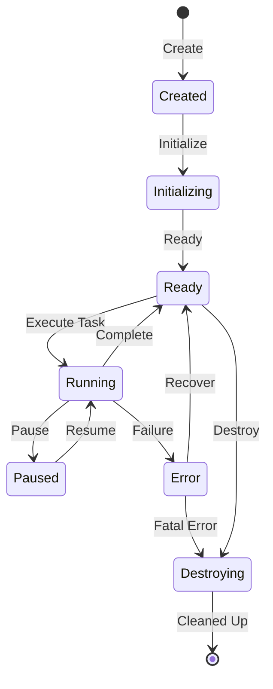

#### Key Interfaces

```protobuf
service AgentKernel {
  rpc CreateAgent(CreateAgentRequest) returns (Agent);
  rpc StartAgent(StartAgentRequest) returns (Agent);
  rpc StopAgent(StopAgentRequest) returns (Agent);
  rpc ExecuteTask(ExecuteTaskRequest) returns (stream TaskEvent);
  rpc GetAgentState(GetAgentStateRequest) returns (AgentState);
  rpc StreamAgentLogs(StreamAgentLogsRequest) returns (stream LogEntry);
}
```

---

### 2. Swarm Manager

The Swarm Manager orchestrates multi-agent collaboration. It handles agent discovery, communication routing, and collective decision-making.

#### Responsibilities

- **Agent Discovery**: Agents register and discover each other
- **Message Routing**: Route messages between agents (point-to-point, broadcast, multicast)
- **Consensus**: Coordinate collective decisions when needed
- **Load Balancing**: Distribute work across agent replicas
- **Failure Detection**: Detect and handle agent failures

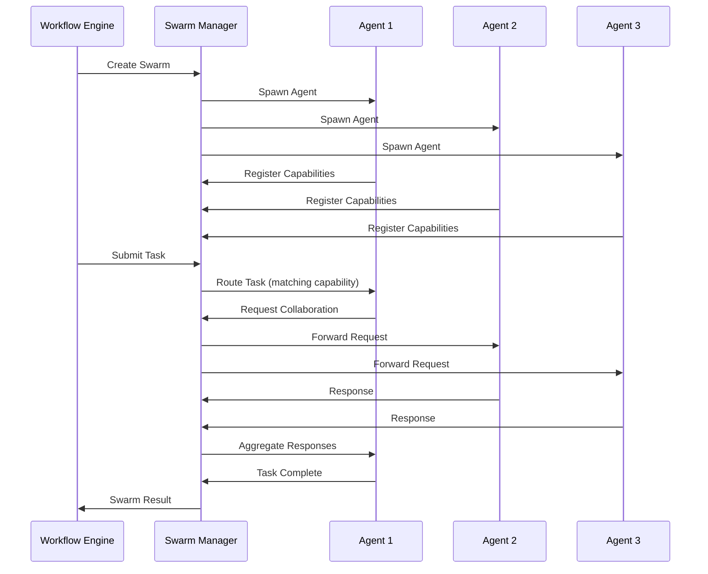

#### Communication Patterns

| Pattern | Use Case | Implementation |
|---------|---------|----------------|
| Point-to-Point | Direct agent messaging | gRPC streams |
| Broadcast | Announcements to all agents | NATS pub/sub |
| Multicast | Targeted group messaging | Topic-based routing |
| Request-Reply | Synchronous coordination | gRPC with timeout |
| Event-Driven | Async state changes | Event bus |

---

### 3. Memory Service

The Memory Service provides persistent storage for agent state, conversation context, and accumulated knowledge.

#### Responsibilities

- **Short-term Memory**: Session context and recent interactions
- **Long-term Memory**: Persistent agent knowledge and learnings
- **Shared Memory**: Inter-agent shared state and messages
- **Vector Storage**: Semantic search over embeddings
- **Checkpointing**: Save and restore agent state

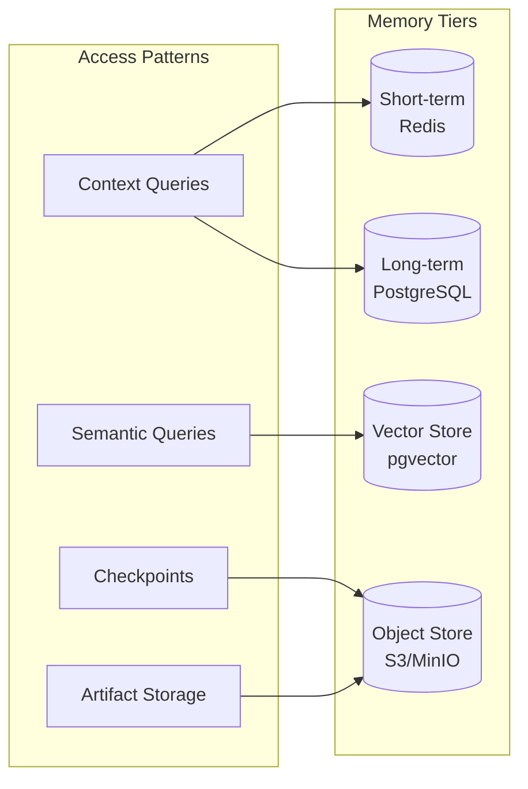

---

### 4. Workflow Engine

The Workflow Engine executes directed acyclic graphs (DAGs) of tasks with dependency management, retry logic, and parallel execution.

#### Responsibilities

- **DAG Execution**: Execute workflows defined as directed graphs
- **Dependency Resolution**: Determine task execution order
- **Parallel Execution**: Run independent tasks concurrently
- **Retry Logic**: Configurable retry with backoff
- **Checkpointing**: Save workflow state for fault tolerance
- **Event Emission**: Emit events at each workflow transition

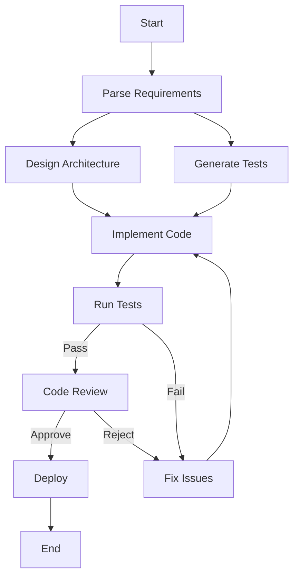

#### Workflow Definition

```yaml
apiVersion: aesp.io/v1
kind: Workflow
metadata:
  name: software-development
spec:
  tasks:
    - id: parse-requirements
      type: agent-task
      agent: requirements-analyst
      input:
        requirements: "${workflow.input.requirements}"
      
    - id: design-architecture
      type: agent-task
      agent: architect
      dependsOn:
        - parse-requirements
      input:
        requirements: "${tasks.parse-requirements.output}"
      
    - id: implement-code
      type: agent-task
      agent: developer
      dependsOn:
        - design-architecture
      input:
        design: "${tasks.design-architecture.output}"
      retry:
        maxAttempts: 3
        backoff: exponential
```

---

### 5. Plugin Manager

The Plugin Manager handles dynamic loading, sandboxing, and lifecycle management of capability plugins.

#### Responsibilities

- **Plugin Discovery**: Find plugins from registries
- **Loading**: Dynamic loading of plugins at runtime
- **Sandboxing**: Isolate plugins for security
- **Lifecycle**: Manage plugin start, stop, and updates
- **API Exposure**: Expose plugin capabilities to agents

#### Plugin Types

| Type | Description | Example |
|------|-------------|---------|
| **Capability Plugin** | Adds new agent capabilities | Code analysis, testing |
| **Integration Plugin** | Connects to external systems | Jira, GitHub, Slack |
| **Model Plugin** | Adds LLM provider support | Custom fine-tuned models |
| **Tool Plugin** | Exposes tools via MCP | File system, web search |

---

### 6. MCP Gateway

The MCP Gateway implements the Model Context Protocol, enabling agents to use external tools and context sources.

#### Responsibilities

- **MCP Client**: Connect to MCP servers as a client
- **MCP Server**: Expose AESP capabilities as an MCP server
- **Tool Registration**: Register and discover tools
- **Context Management**: Manage context from MCP sources
- **Protocol Translation**: Translate between internal and MCP protocols

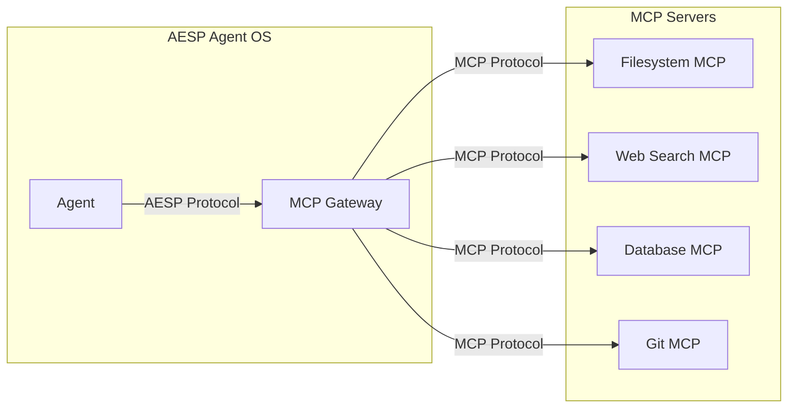

---

### 7. Model Router

The Model Router provides intelligent routing across multiple LLM providers with fallback, load balancing, and caching.

#### Responsibilities

- **Provider Abstraction**: Unified interface for all LLM providers
- **Intelligent Routing**: Route requests based on model capabilities and cost
- **Fallback**: Automatic fallback on provider failure
- **Caching**: Cache responses to reduce cost and latency
- **Rate Limiting**: Enforce rate limits per provider
- **Cost Tracking**: Track and optimize LLM spend

#### Routing Strategies

| Strategy | Description | Use Case |
|----------|-------------|----------|
| **Capability-based** | Route based on model capabilities | Complex reasoning → GPT-4 |
| **Cost-based** | Route to cheapest capable model | Simple tasks → GPT-3.5 |
| **Latency-based** | Route to fastest available | Real-time applications |
| **Round-robin** | Distribute across providers | High-volume workloads |
| **Fallback** | Retry with different provider | Provider outage |

---

### 8. Observability Stack

The Observability Stack provides comprehensive visibility into the system through traces, metrics, logs, and events.

#### Components

| Component | Technology | Purpose |
|-----------|-----------|---------|
| **Tracing** | OpenTelemetry + Jaeger | Request flow visualization |
| **Metrics** | OpenTelemetry + Prometheus | Performance and health metrics |
| **Logging** | Structured JSON logs | Debug and audit trails |
| **Events** | Event bus + WebSocket | Real-time event streaming |
| **Dashboard** | Grafana | Visualization and alerting |

#### Key Metrics

| Metric | Description | Labels |
|--------|-------------|--------|
| `aesp_agent_executions_total` | Total agent executions | agent_type, status |
| `aesp_task_duration_seconds` | Task execution duration | task_type |
| `aesp_swarm_size` | Current swarm size | swarm_id |
| `aesp_memory_usage_bytes` | Memory usage | agent_id |
| `aesp_llm_requests_total` | LLM requests | provider, model |
| `aesp_llm_tokens_total` | Token consumption | provider, model |

---

## Data Flow

### Request Lifecycle

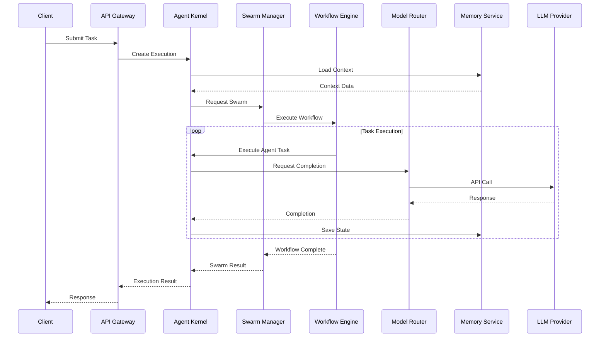

### Event Flow

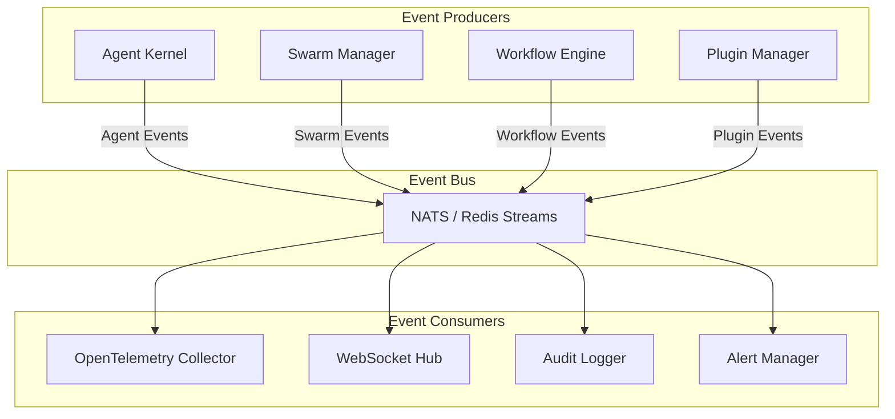

---

## Technology Stack

### Core Runtime

| Technology | Version | Purpose |
|-----------|---------|---------|
| Go | 1.23+ | Primary implementation language |
| Protocol Buffers | 3+ | Interface definition |
| gRPC | 1.60+ | Inter-service communication |
| PostgreSQL | 15+ | Primary database |
| Redis | 7+ | Cache and message broker |
| NATS | 2.10+ | Event streaming |

### Observability

| Technology | Purpose |
|-----------|---------|
| OpenTelemetry | Distributed tracing and metrics |
| Prometheus | Metrics collection |
| Grafana | Visualization |
| Jaeger | Trace visualization |

### Deployment

| Technology | Purpose |
|-----------|---------|
| Docker | Containerization |
| Kubernetes | Orchestration |
| Helm | Package management |
| Terraform | Infrastructure as code |

### SDKs

| Language | Status | Use Case |
|----------|--------|----------|
| Go | Primary | System development |
| Python | Planned | ML/AI integrations |
| TypeScript | Planned | Web and Node.js |

---

## Deployment Architecture

### Single-Node (Development)

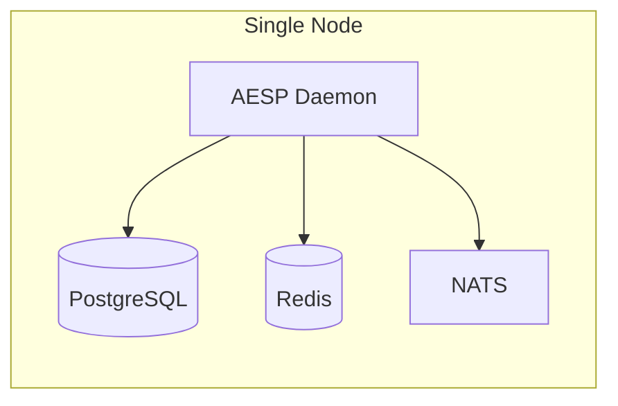

### High Availability (Production)

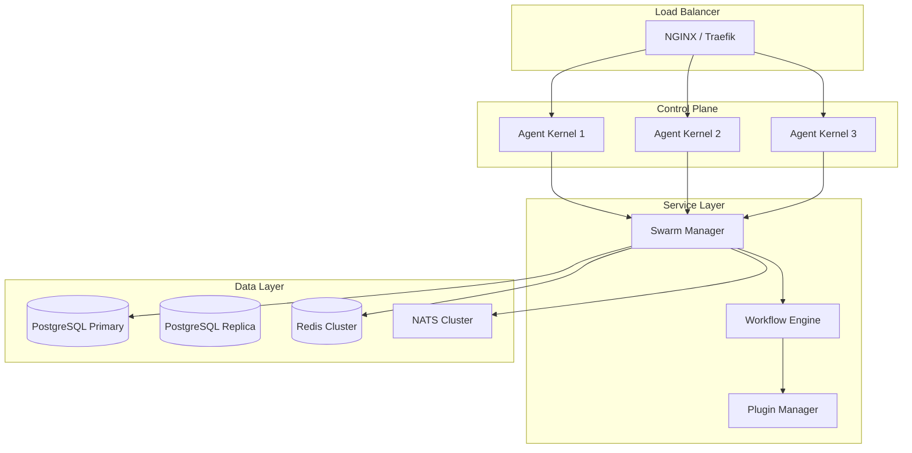

---

## Security Model

### Authentication

- **API Keys**: For service-to-service authentication
- **JWT Tokens**: For user authentication
- **mTLS**: For internal service communication

### Authorization

- **RBAC**: Role-based access control
- **ABAC**: Attribute-based access control for fine-grained permissions
- **Policy Engine**: OPA (Open Policy Agent) for policy enforcement

### Data Protection

- **Encryption at Rest**: Database encryption via PostgreSQL TDE
- **Encryption in Transit**: TLS 1.3 for all communications
- **Secret Management**: HashiCorp Vault integration

---

## Extensibility

The system is designed for extensibility at multiple levels:

### Plugin Architecture

Add new capabilities without modifying core code through the Plugin Manager.

### Custom Model Providers

Implement the Model Router interface to add support for new LLM providers.

### Custom Storage Backends

Implement the Memory Service interface to use different storage systems.

### Event Consumers

Subscribe to the event bus to build custom integrations and automations.

### Custom Workflows

Define new workflow templates using the YAML workflow definition format.

---

## Related Documents

- [ADR-0001: Modular Architecture](adr/0001-use-modular-architecture.md)
- [ADR-0002: Language Selection](adr/0002-language-selection.md)
- [AESP Specification](https://github.com/kishoreHQ/AESP)
- [API Documentation](https://aesp.dev/api)

---

*This document is a living document and will be updated as the architecture evolves.*
